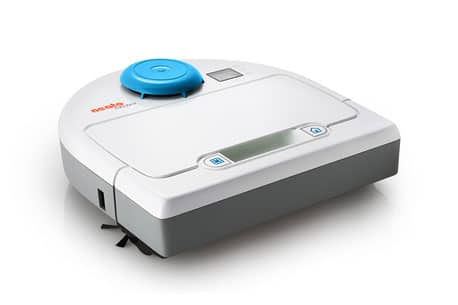
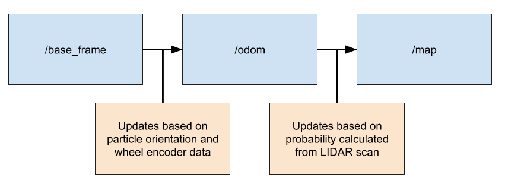
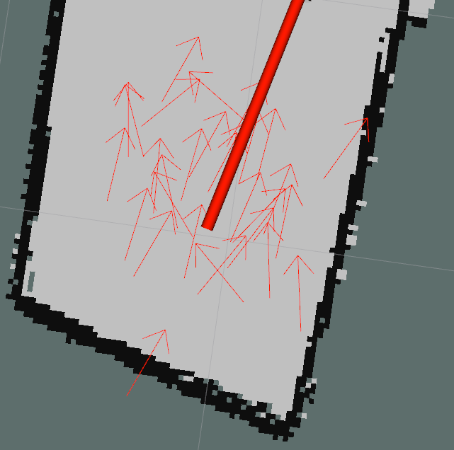
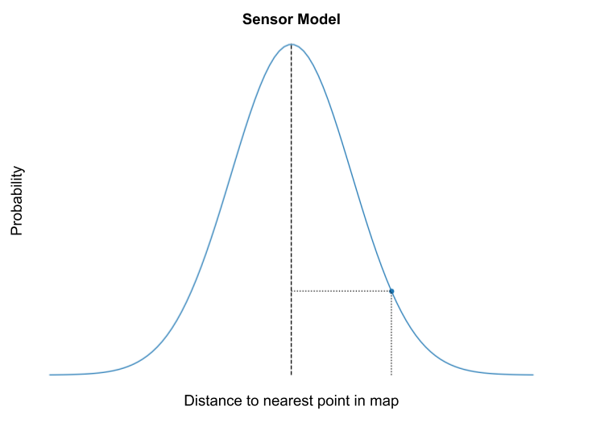
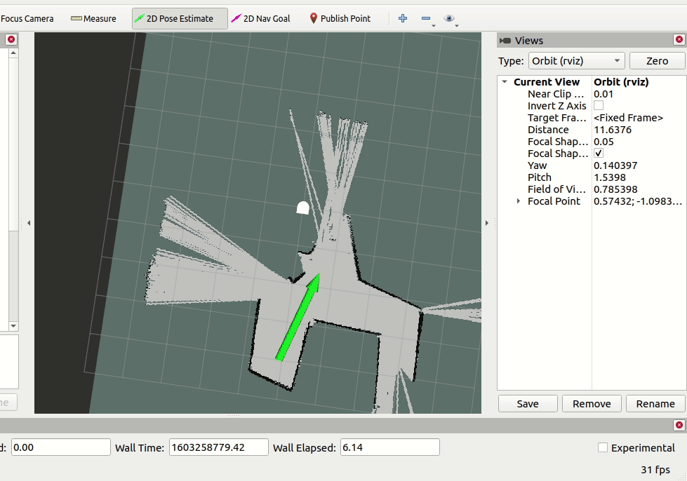

# robot_localization
*ENGR3590: A Computational Introduction to Robotics, Olin College of Engineering, FA2020*

*Nathan Estill, Jonathan Zerez*

This is the base repo for the Olin Computational Robotics Robot Localization project. The goal of the project was to implement a particle filter in order to localize a robot within a known map.

This project's robotic platform is the NEATO vacuum robot. The NEATO is equipped with a number of basic sensors including wheel encoders, a small array of bump sensors, and a 2D LIDAR unit. Below is an image of a NEATO. The blue circle atop the unit is the LIDAR sensor.

## Running the Code
The code can be run in two ways, to run the code on a prerecorded bag file, paste the following into your command line once you've cloned the repo:

`roslaunch robot_localizer test_bagfile.launch map_name:=ac109_1`

To run the particle filter with the goal of localizing the NEATO in real time, paste the following command into your command line:

`roslaunch robot_localizer test_live.launch map_name:=ac109_1`

In both cases, the map name can be changed to any of the file names found in the `/maps` directory.

Once the rviz window opens, simply provide a 2D pose estimation to initialize the particles, and you're good to go! Note, the initial pose estimation needs to be pretty good in order for the particle filter to work well.

## Architecture and Implementation
In order to complete this project, we need to find the transform that relates the odometry frame to the global map frame. We know that there is a certain amount of noise and imprecision in the NEATO's wheel encoders, so we know that the odometry frame is almost guaranteed to drift away from the global frame over time. This is where the particle filter comes in. The particle filter uses data from the NEATO's LIDAR sensor in order to periodically correct the deviation of the `/odom` frame from the map frame.

The particle filter works by first initializing a set of particles based on the provided initial 2D pose estimation. Each particle has three attributes, an x position in meters, a y position in meters, and an orientation in radians. Once the NEATO starts moving, we translate each point based on readings from the encoder. We then use the LIDAR to calculate the probability that any given particle represents the true position of the robot. Finally, we re-sample the particles based on their probabilities.

### Initializing the particles
For our initial set of particles, we get an initial pose estimate from clicking in Rviz. We take this pose estimate and create particles that are normally distributed around this point. The particles are also normally distributed around the orientation of the initial pose estimate.

### Updating the `/odom` frame from encoders
To ensure that the particles keep up with the robots movement, we transform them based on the '/odom' topic. One major design decision we made was in how we handled this update. One path forward was to calculate the change relative to the NEATO's orientation. For example, if the NEATO moved directly forward relative to its own heading, the particles would also move directly forward relative to their own heading. The other path was to calculate the change relative to the position overall. For example, if the NEATO moves 1 meter in the x direction and 0.5 meters in the y direction, the particles would also move 1 meter in the x direction and 0.5 meters in the y direction. We ended up choosing the latter because it was much simpler to implement and the additional accuracy would not have that great of an impact because the particles are mostly facing the same direction. So for each time step, we calculate the difference between the previous odom pose and the current odom pose and apply that difference to each of our particles. Additionally, each particle also moves by a certain amount of random noise that is proportional to the amount that it moved in both translational and rotational amounts.

### Transforming the LIDAR scan to each particle's reference frame and then to the map frame
Because the LIDAR scan is given as a distance and angle, it has to be transferred to Cartesian coordinates. It also has to be in the map's frame so that we can later compare the points to the points in the map. For each particle, we first add the particles orientation to the angle coordinates of the LIDAR's points. Then we convert the resulting polar coordinates to Cartesian, which results in a set of points localized around each particle. We then add the particle's x and y locations to get each point in the map's frame of reference.

### Calculating the weight of each particle
Once the LIDAR scan points are transformed into the local coordinate system for a given particle, we then move on to calculate the so called "weight" of the particle, which is essentially a measure of how good of a guess a given particle is. The better a particle's position and orientation explain the LIDAR data, the higher its weight will be.

In order to calculate the weight of a particle, we first need to implement our sensor model. In our case, we assume that the LIDAR sensor returns distance values that follow a normal distribution with a standard deviation of 2 cm from the mean. For each LIDAR point in the particle's frame, we calculate the nearest point in the map. We then assign a probability to each point by picking the corresponding probability* from our distribution function given the distance to the nearest point.

\**technically, probability isn't quite the right word to use here. A normal distribution usually is a probability density function, which requires one to integrate over a range of values in order to generate a probability. Rather, our function is simply a relative measure of the likelihood that the LIDAR returns a certain value given some actual distance between the LIDAR's origin and an obstacle. We scaled the function such that the peak of the graph is 1.00*

We calculate the weight associated with every point in the LIDAR scan for each particle in the filter. We then take the cube of each weight and then take the average value. This gives us an scalar value from 0 to 1 that represents the total weight of a given particle (or how well that specific particle explains the LIDAR data observed).

### Resampling the particles based on weights
After calculating the weight of each particle, we want to remove some particles that are poor estimate's of the robot's pose, and resample them. To do this, we define a weight threshold. If a particle's weight is above the threshold, it remains unchanged, but if its weight is less than the threshold, its position changes to match one of the particle's whose weight was above the threshold. The higher a particle's weight, the higher chance that a poor particle will change to match that particle's position. The particles exactly match the assimilated particle, as noise is applied in the odometry transforms.

### Results
Below is an animation of our particle filter in action. The big red arrow represents the ground truth pose of the NEATO in the map, and the cloud of red arrows represents the particles of the filter. The red points that are moving around are the NEATO's LIDAR observations placed in the average pose predicted by the particles (weighted by each particles weight).

There are a few points in time where the average estimated position deviates quite a bit from the ground truth, but all in all, it seems to work pretty well. 

## Design Decisions
One design decision that we made was to make the odometry applied to the particles noisy as opposed to the resampling. We did this so that larger changes in movement would result in larger spreads of the particle. This aligns with the idea that the more the robot moves, the higher the odometry will be off from the ground truth.

## Challenges
Plotting in Rviz in such a way that conveys the information we wanted was a big challenge. Initially, we plotted Marker points for the particles, but those markers are sometimes too big. When we wanted to communicate the weights of each particle, scaled the length of each arrow by the weight. However, it gets harder to determine the exact locations when so many arrows are overlapping. I don't think we found a winning visualization aside from changing the form based on what property we wanted to single out.

Another challenge we had was for the particle filter to run quickly. When we raised the number of particles to 100, it took a long time to update, so we were forced to use a lower number of particles. We later only used half of the laser scan, but it still ran somewhat slowly.

## Important Learning Takeaways

Having a well established visualization method is crucial to being able to effectively debug robotics code. Seeing each of the arrows in Rviz really helped us find and remove mistakes that we had made that would have taken a lot longer if we had manually gone through and tried to find inconsistencies.

Another important takeaway was the value of testing as you develop code/functions. Because we tested as we went along, it allowed us to focus on one thing at a time and to not get overwhelmed.
